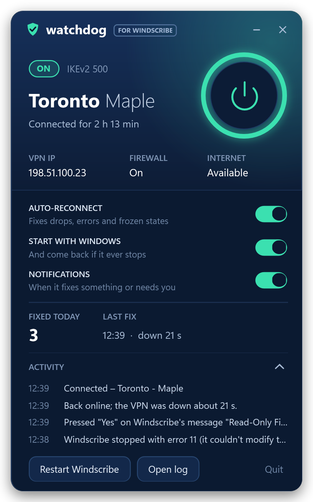
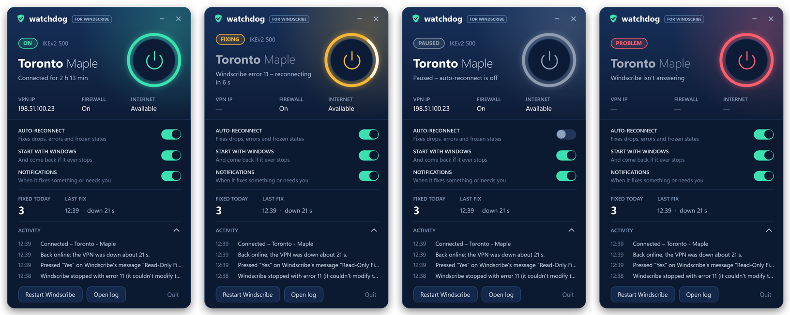

<p align="center">
  
</p>

<h1 align="center">Windscribe Watchdog</h1>

<p align="center">
  Keeps <a href="https://windscribe.com">Windscribe</a> connected on Windows. It notices when the VPN drops,
  errors out or gets stuck, and fixes it without you.
</p>

## Why

Windscribe usually reconnects by itself. Sometimes it gives up instead: after a failed retry it sits at
"Disconnected", stops on an error such as 11 ("Can't modify hosts file"), or waits behind a
*"Your hosts file is read-only"* prompt until someone clicks it. On a flaky or filtered network that can
mean hours offline before you notice.

## What it does

| When Windscribe… | Watchdog… |
|---|---|
| drops and stops retrying | reconnects it, retrying after 15 s, 30 s, 1 min, 2 min, then every 3 min |
| stops on an error (e.g. 11) | treats it like a drop and reconnects |
| asks *"Your hosts file is read-only… Fix the issue automatically?"* | answers **Yes**, as you would; Windscribe then fixes the file and reconnects |
| shows an error notice with only an OK button | dismisses it |
| freezes (stops answering for 90 s) or is stuck connecting for 10 minutes | restarts the Windscribe app (at most 3 times per 30 minutes) |
| can't reach its own servers ("SSL error" on a filtered network) | keeps the VPN connected with the session Windscribe already has, and tells you |
| crashes, or its service stops | starts them again |

It also looks after itself: a scheduled task starts it again within 5 minutes if it ever stops, and a
frozen check loop is replaced with a fresh one.

## What it leaves alone

- **A Disconnect you press.** It reads Windscribe's own log to tell your Disconnect apart from a drop,
  and waits until you connect again.
- **Quitting Windscribe** yourself.
- **Signing in.** It never touches your credentials.
- **Any question that would change a setting or your security**, such as "Ignore SSL errors?",
  "Switch connection mode to Auto?" or sending a debug log. It shows a notification instead.

It makes no network requests of its own and needs no admin rights.

## The window

Left-click the shield in the tray to open it. The ring shows the state at a glance; click it to pause or
resume auto-reconnect.



Green: connected. Amber: fixing something. Gray: paused, or standing by (you disconnected, or Windscribe
is closed). Red: a problem it hasn't been able to fix yet.

## Install

You need Windows 10 or 11 and Windscribe 2.x (the watchdog uses its `windscribe-cli`). Nothing else.

### Quick: download the app

1. Download `WindscribeWatchdog.exe` from the
   [latest release](https://github.com/rezahadinezhad/windscribe-watchdog/releases/latest).
2. Put it in a folder where it can stay (it keeps its log next to itself), for example
   `%LOCALAPPDATA%\Programs\WindscribeWatchdog`, and run it.
3. Windows may say *"Windows protected your PC"*, because the exe isn't code-signed. Click
   **More info → Run anyway**. (You can check the source and build it yourself instead; see below.)

It adds itself to startup. For the keepalive task that brings it back if it ever stops, use the
install script below.

### Full: build and install from source

The app is built with the C# compiler that ships with Windows. Download or clone this repository, then
in its folder run:

```powershell
powershell -ExecutionPolicy Bypass -File install.ps1
```

This builds the app, installs it to `%LOCALAPPDATA%\Programs\WindscribeWatchdog`, registers the
keepalive task and starts it. Run it again to update.

To remove it:

```powershell
powershell -ExecutionPolicy Bypass -File "$env:LOCALAPPDATA\Programs\WindscribeWatchdog\uninstall.ps1"
```

## How it works

- While connected it checks every 5 seconds whether Windscribe's log has grown (anything that happens to
  the connection is logged there) and only runs `windscribe-cli status` when it has, or once a minute.
  While something is wrong it runs it every 5 seconds. This keeps CPU use negligible and adds as little
  as possible to Windscribe's own log.
- Its own `watchdog.log` is capped at 1 MB, plus one older 1 MB file.
- To tell your Disconnect apart from a drop, it reads Windscribe's log
  (`%LOCALAPPDATA%\Windscribe\Windscribe2\client.log`): Windscribe writes
  `ConnectionManager::clickDisconnect()` only when Disconnect is used.
- It reads and answers Windscribe's message boxes through Windows UI Automation, only in the cases above.
- If Windscribe's service stops, it starts it again (Windscribe lets signed-in users do that).
- Everything it does is written to `watchdog.log` next to the exe ("Open log" in the window).

## Build

```powershell
powershell -ExecutionPolicy Bypass -File build.ps1             # -> bin\WindscribeWatchdog.exe
powershell -ExecutionPolicy Bypass -File tools\screenshots.ps1 # refreshes the images in docs\
```

`WindscribeWatchdog.exe --preview out.png [connected|fixing|paused|problem]` draws the window with
made-up data.

| File | What's in it |
|---|---|
| `src/Watchdog.cs` | the check loop: what it notices and what it does about it |
| `src/Windscribe.cs` | `windscribe-cli`, Windscribe's logs, app and service |
| `src/Dialogs.cs` | finding and answering Windscribe's message boxes |
| `src/MainWindow.xaml`, `src/MainWindow.cs` | the window |
| `src/TrayApp.cs` | tray icon and menu, keepalive and startup |

## Disclaimer

Not affiliated with or endorsed by Windscribe Limited. "Windscribe" is a trademark of its owner, used here
only to say which app this tool works with.

## License

[MIT](LICENSE)
